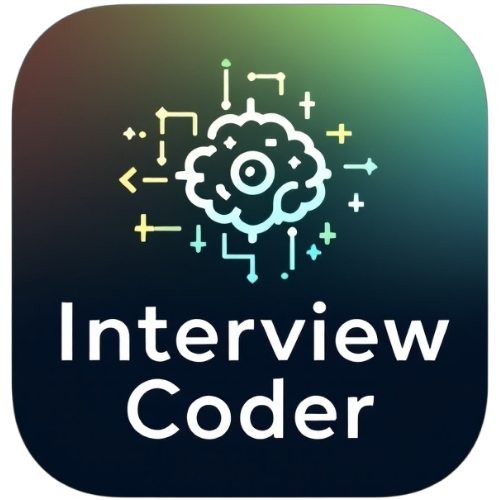

# <div align="center">Interview Coder</div>

<div align="center">
  
  <br/>
  <br/>
  <strong>Your AI-Powered Coding Interview Assistant</strong>
  <br/>
  <br/>
</div>

<div align="center">

[](https://opensource.org/licenses/MIT)


</div>

<hr/>

## 🚀 Overview

Interview Coder is an advanced Electron application that leverages AI to analyze screenshots and assist with coding interviews. Whether you need to solve coding problems, generate code, or get detailed explanations, Interview Coder has got you covered with support for multiple AI providers and a seamless user experience.

## ✨ Key Features

- 📸 **Smart Screenshot Capture**
  - Global keyboard shortcuts for instant captures
  - Support for window and area-specific screenshots
  - Multi-page mode for complex questions

- 🤖 **Powerful AI Integration**
  - OpenAI integration (GPT-4 Vision)
  - Google Gemini support
  - Local Ollama compatibility
  - Real-time streaming responses

- 🎙️ **Real-time Audio Transcription**
  - Capture and transcribe system audio in real-time
  - Perfect for interviews, meetings, and presentations
  - Powered by Google Gemini AI
  - Toggled with a simple keyboard shortcut

- 📎 **File Attachments**
  - Support for images, documents, and code files
  - Send files directly to AI for analysis
  - Preview and view attached images
  - Intelligent context-based prompts based on file type

- 🌐 **Multilingual Support**
  - Responses in 8 different languages
  - English, Vietnamese, Spanish, French, German, Japanese, Korean, and Chinese
  - Language preferences persist across sessions

- 🎯 **User-Friendly Interface**
  - Transparent, always-on-top window
  - Markdown-rendered responses
  - Customizable positioning
  - Platform-aware keyboard shortcuts
  - Collapsible settings sections

## 🛠️ Prerequisites

- [Node.js](https://nodejs.org/) (v18 or later recommended)
- [npm](https://www.npmjs.com/) or [yarn](https://yarnpkg.com/)
- For AI functionality (one of the following):
  - OpenAI API key
  - Google Gemini API key
  - [Ollama](https://ollama.ai/) running locally

## 📦 Installation

1. **Clone the Repository**
   ```bash
   git clone https://github.com/MinhOmega/interview-coder.git
   cd interview-coder
   ```

2. **Install Dependencies**
   ```bash
   npm install
   ```

3. **Run the Application**
   ```bash
   npm start
   ```

## 🔧 AI Configuration

No environment configuration is required to get started. API keys can be entered directly in the application:

1. Launch Interview Coder
2. Press `⌘+,` (Mac) or `Ctrl+,` (Windows/Linux) to open the settings
3. Choose your preferred AI provider (OpenAI, Google Gemini, or Ollama)
4. Enter your API key when prompted
5. Select your preferred model
6. Choose your preferred response language
7. Save settings and start using!

## 🔧 Using with Ollama

1. Install Ollama from [ollama.ai](https://ollama.ai/)
2. Start the Ollama service
3. Pull a vision-capable model:
   ```bash
   ollama pull deepseek-r1:14b
   ```
4. Launch Interview Coder
5. Press `⌘+,` (Mac) or `Ctrl+,` (Windows/Linux) to open the settings
6. Select "Ollama" as your AI provider
7. Configure the Ollama base URL if needed (default: http://127.0.0.1:11434)
8. Choose your preferred model from the dropdown
9. Save settings and start using!

## 🌐 Language Settings

Choose your preferred language for AI responses:

1. Press `⌘+,` (Mac) or `Ctrl+,` (Windows/Linux) to open the settings
2. Scroll down to the "Response Language" section
3. Select your language from the available options:
   - English (default)
   - Vietnamese (Tiếng Việt)
   - Spanish (Español)
   - French (Français)
   - German (Deutsch)
   - Japanese (日本語)
   - Korean (한국어)
   - Chinese (中文)
4. Save settings to apply your language preference

The application will generate all AI responses in your selected language, with solution approaches tailored to your language preference.

## 🔧 Troubleshooting

### macOS Issues

If you encounter issues opening the application on macOS due to security restrictions or "app is damaged" warnings, try running the following command in Terminal:

```bash
xattr -cr /Applications/Interview\ Coder.app
```

This removes quarantine attributes that might prevent the app from running properly on macOS.

## ⌨️ Keyboard Shortcuts

### macOS
| Shortcut           | Action                                            |
| ------------------ | ------------------------------------------------- |
| `⌘ + ,`            | Open settings                                     |
| `⌘ + B`            | Toggle window visibility                          |
| `⌘ + H`            | Capture window screenshot                         |
| `⌘ + D`            | Capture selected area                             |
| `⌘ + A`            | Add screenshot (multi-page)                       |
| `⌘ + Enter`        | Process screenshots                               |
| `⌘ + R`            | Reset current process or reset chat in split view |
| `⌘ + N`            | Create new chat                                   |
| `⌘ + T`            | Toggle split view                                 |
| `⌘ + P`            | Toggle system prompt                              |
| `⌘ + Q`            | Quit application                                  |
| `⌘ + M`            | Process current screenshot into chat mode         |
| `⌘ + S`            | Toggle audio transcription                        |
| `⌘ + Shift + ↑↓←→` | Move window                                       |
| `Shift + ↑↓`       | Scroll up/down (working in split view)            |
| `⌘ + Shift + =`    | Increase window size                              |
| `⌘ + Shift + -`    | Decrease window size                              |
| `⌘ + Shift + I`    | Toggle DevTools                                   |
| `⌘ + /`            | Show hotkeys                                      |

### Windows/Linux
| Shortcut              | Action                                            |
| --------------------- | ------------------------------------------------- |
| `Ctrl + ,`            | Open settings                                     |
| `Ctrl + B`            | Toggle window visibility                          |
| `Ctrl + H`            | Capture window screenshot                         |
| `Ctrl + D`            | Capture selected area                             |
| `Ctrl + A`            | Add screenshot (multi-page)                       |
| `Ctrl + Enter`        | Process screenshots                               |
| `Ctrl + R`            | Reset current process or reset chat in split view |
| `Ctrl + N`            | Create new chat                                   |
| `Ctrl + T`            | Toggle split view                                 |
| `Ctrl + P`            | Toggle system prompt                              |
| `Ctrl + Q`            | Quit application                                  |
| `Ctrl + M`            | Process current screenshot into chat mode         |
| `Ctrl + S`            | Toggle audio transcription                        |
| `Ctrl + Shift + ↑↓←→` | Move window                                       |
| `Shift + ↑↓`          | Scroll up/down (working in split view)            |
| `Ctrl + Shift + =`    | Increase window size                              |
| `Ctrl + Shift + -`    | Decrease window size                              |
| `Ctrl + Shift + I`    | Toggle DevTools                                   |
| `Ctrl + /`            | Show hotkeys                                      |

> **Note for Linux users:** Alternative key bindings may be used automatically if the primary shortcuts cannot be registered.

## 📎 Using File Attachments

You can attach various file types to your conversations:

1. Click the paperclip icon in the chat input area
2. Select a file from your computer (supports images, documents, code files)
3. The file will be previewed before sending
4. Type your message or send directly to let the AI analyze the file
5. For images, you can click on them to view in full size

## 🎙️ Audio Transcription

Interview Coder can transcribe audio in real-time, making it perfect for interviews, meetings, and presentations:

1. Make sure you have a Google Gemini API key configured
2. Press `⌘ + S` (Mac) or `Ctrl + S` (Windows/Linux) to start audio transcription
3. When prompted, allow access to your microphone and system audio
4. A transcription window will appear showing the captured text in real-time
5. Press the same shortcut again to stop transcription
6. The transcription window will remain open until manually closed

**Note:** For system audio transcription, you may need to select a display or window to share when prompted. This allows the app to capture both microphone and system audio simultaneously.

## 🤖 Supported AI Models

### OpenAI
- gpt-4o-mini
- gpt-4o
- gpt-4-vision-preview
- gpt-4-turbo

### Google Gemini
- gemini-2.0-flash

### Ollama
- deepseek-r1:14b (recommended)
- Any vision-capable Ollama model

## ⚠️ Status

This project is under active development. While core features are functional, you may encounter occasional bugs or incomplete features. Your feedback and contributions are welcome!

## 💭 Personal Note

Inspired by interviewcoder.co but with a twist - making the tool openly available rather than behind paywalls. This project aims to challenge the status quo of technical interviews and encourage companies to explore more comprehensive ways of assessing candidates beyond traditional coding challenges.

## Development Mode with Hot Reload

This application supports a development mode with hot reloading for a more efficient development experience.

### Running in Development Mode

Use these npm scripts to run the application with hot reload enabled:

```bash
# For macOS/Linux
npm run dev

# For Windows
npm run dev:windows
```

## Chat Features

- Reset Chat: You can reset the current chat to its initial state by pressing `⌘+R` (Mac) or `Ctrl+R` (Windows/Linux) while in split view.
- New Chat: You can create a new chat session by pressing `⌘+N` (Mac) or `Ctrl+N` (Windows/Linux).
- File Attachments: You can attach files to your messages by clicking the attachment button in the chat input area.

<div align="center">
<br/>
Made with ❤️ by <a href="mailto:vnqminh0502@gmail.com">Minh Vo</a>
</div>