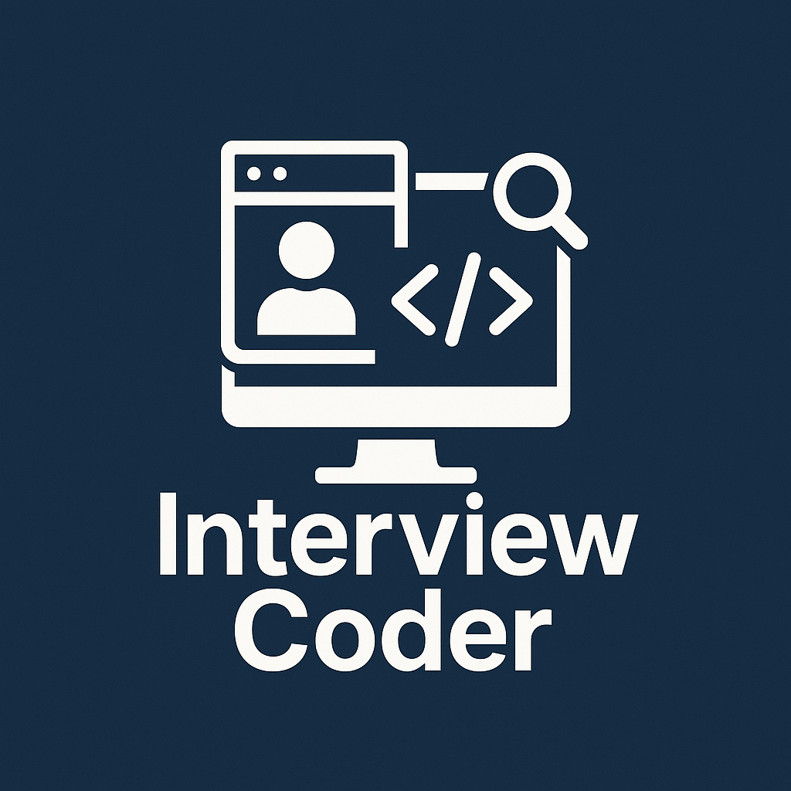

# <div align="center">Interview Coder</div>

<div align="center">
  
  <br/>
  <br/>
  <strong>Your AI-Powered Coding Interview Assistant</strong>
  <br/>
  <br/>
</div>

<div align="center">

[](https://opensource.org/licenses/MIT)


</div>

<hr/>

## 🚀 Overview

Interview Coder is an advanced Electron application that leverages AI to analyze screenshots and assist with coding interviews. Whether you need to solve coding problems, generate code, or get detailed explanations, Interview Coder has got you covered with support for multiple AI providers and a seamless user experience.

## ✨ Key Features

- 📸 **Smart Screenshot Capture**
  - Global keyboard shortcuts for instant captures
  - Support for window and area-specific screenshots
  - Multi-page mode for complex questions

- 🤖 **Powerful AI Integration**
  - OpenAI integration (GPT-4 Vision)
  - Google Gemini support
  - Local Ollama compatibility
  - Real-time streaming responses

- 🎯 **User-Friendly Interface**
  - Transparent, always-on-top window
  - Markdown-rendered responses
  - Customizable positioning
  - Platform-aware keyboard shortcuts

## 🛠️ Prerequisites

- [Node.js](https://nodejs.org/) (v18 or later recommended)
- [npm](https://www.npmjs.com/) or [yarn](https://yarnpkg.com/)
- One of the following:
  - OpenAI API key
  - Google Gemini API key
  - [Ollama](https://ollama.ai/) (for local AI processing)

## 📦 Installation

1. **Clone the Repository**
   ```bash
   git clone https://github.com/MinhOmega/interview-coder.git
   cd interview-coder
   ```

2. **Install Dependencies**
   ```bash
   npm install
   ```

3. **Configure Environment**
   Create a `.env` file in the project root:
   ```env
   OPENAI_API_KEY=YOUR_OPENAI_API_KEY
   OPENAI_MODEL=gpt-4o-mini
   GEMINI_API_KEY=YOUR_GEMINI_API_KEY
   GEMINI_MODEL=gemini-2.0-flash
   AI_PROVIDER=openai
   OLLAMA_BASE_URL=http://127.0.0.1:11434
   OLLAMA_MODEL=deepseek-r1:14b
   ```

## 🔧 Using with Ollama

1. Install Ollama from [ollama.ai](https://ollama.ai/)
2. Start the Ollama service
3. Pull a vision-capable model:
   ```bash
   ollama pull deepseek-r1:14b
   ```
4. Launch Interview Coder
5. Press `⌘+M` (Mac) or `Ctrl+M` (Windows/Linux) to open settings
6. Select "Ollama" and your preferred model
7. Save settings and start using!

## ⌨️ Keyboard Shortcuts

### macOS
| Shortcut | Action |
|----------|--------|
| `⌘ + H` | Capture window screenshot |
| `⌘ + D` | Capture selected area |
| `⌘ + A` | Add screenshot (multi-page) |
| `⌘ + ↵` | Process screenshots |
| `⌘ + R` | Reset current process |
| `⌘ + M` | Open model selector |
| `⌘ + Q` | Quit application |
| `⌘ + B` | Toggle window visibility |
| `⌘ + ↑↓←→` | Move window |

### Windows/Linux
| Shortcut | Action |
|----------|--------|
| `Ctrl + H` | Capture window screenshot |
| `Ctrl + D` | Capture selected area |
| `Ctrl + A` | Add screenshot (multi-page) |
| `Ctrl + Enter` | Process screenshots |
| `Ctrl + R` | Reset current process |
| `Ctrl + M` | Open model selector |
| `Ctrl + Q` | Quit application |
| `Ctrl + B` | Toggle window visibility |
| `Ctrl + ↑↓←→` | Move window |

## 🤖 Supported AI Models

### OpenAI
- gpt-4o-mini
- gpt-4o
- gpt-4-vision-preview
- gpt-4-turbo

### Google Gemini
- gemini-2.0-flash

### Ollama
- deepseek-r1:14b (recommended)
- Any vision-capable Ollama model

## ⚠️ Status

This project is under active development. While core features are functional, you may encounter occasional bugs or incomplete features. Your feedback and contributions are welcome!

## 💭 Personal Note

Inspired by interviewcoder.co but with a twist - making the tool openly available rather than behind paywalls. This project aims to challenge the status quo of technical interviews and encourage companies to explore more comprehensive ways of assessing candidates beyond traditional coding challenges.

<div align="center">
<br/>
Made with ❤️ by <a href="mailto:vnqminh0502@gmail.com">Minh Vo</a>
</div>
